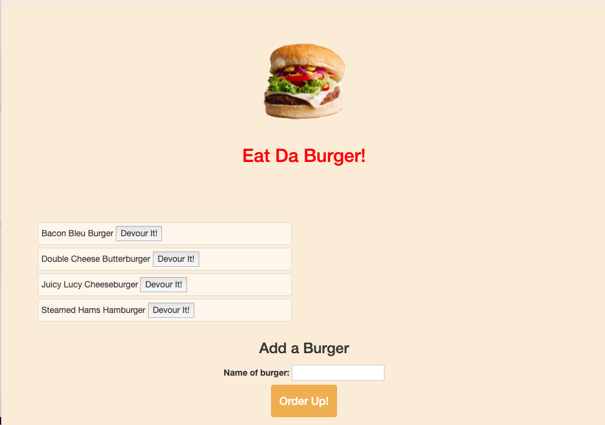
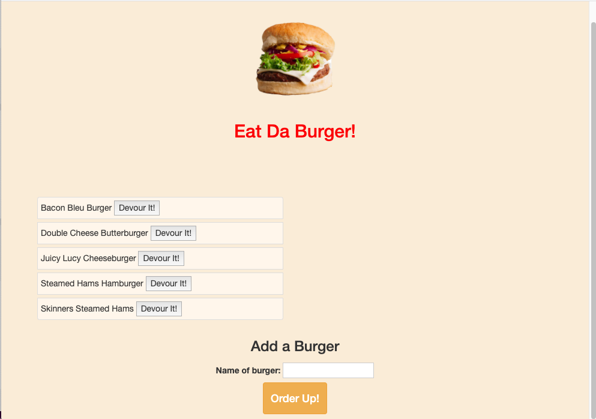
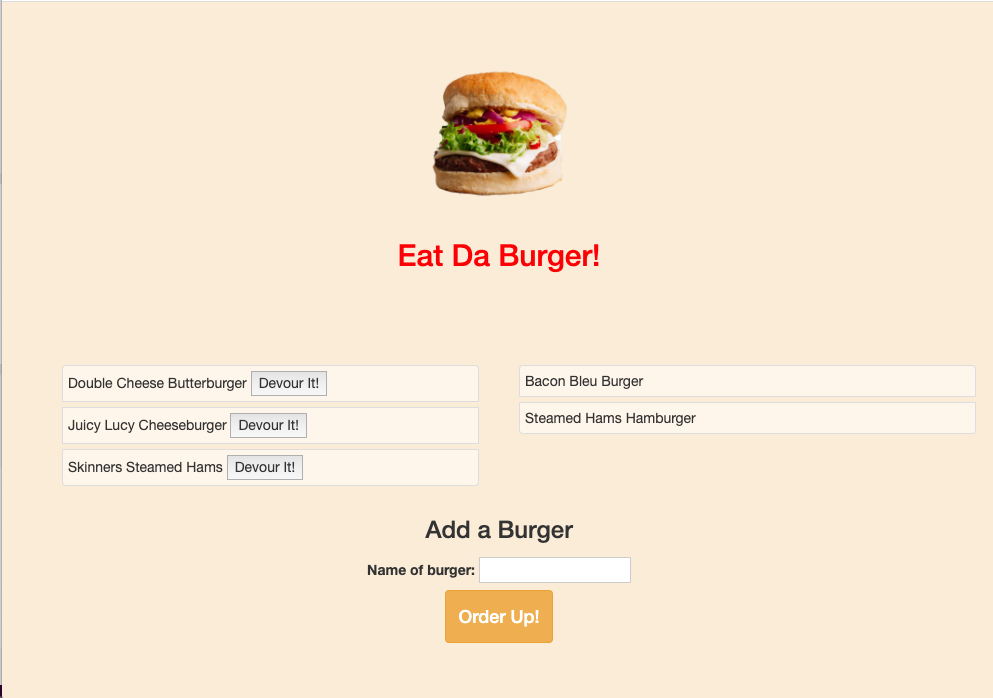

# Unit 12: Node Express Handlebars - Eat Da Burger

https://immense-thicket-63740.herokuapp.com/

### Description

For this project we created a burger app that created 'burgers', 'devoured' said burgers with a button, that would display on the other side of the page.
We designed our site with the model-view-controller pattern using MySql, Node, Express, Express Handlebars, and the Object Relational Model.

### User Story

AS A burger enthusiast who wants to devour burgers
I WANT to submit a name of a burger
SO THAT I can devour it.

### Screenshots 

### Challenges

The majority of this assignment was understanding the complex nature of the Object relational model. It is a stepping stone to sequelize, which will alleviate some of the drawback of the orm. Moreover, the documentation for deploying to Heroku is completely dated and lost in today's times.